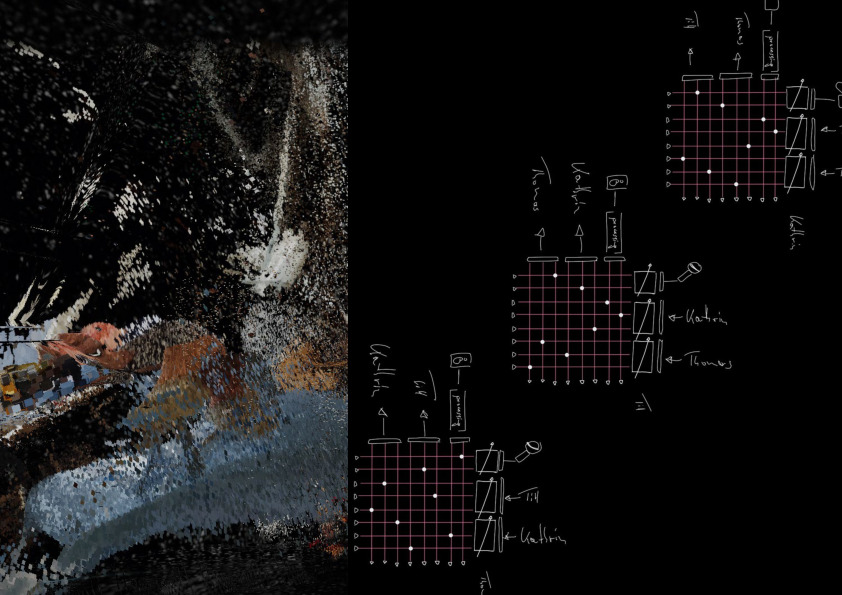
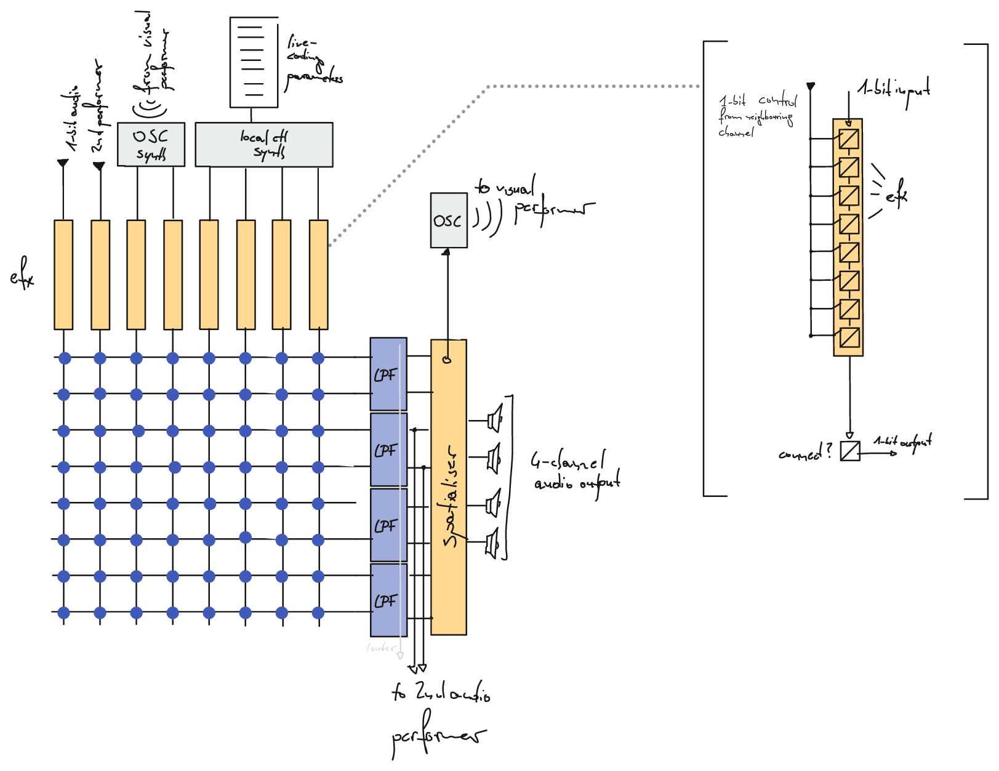

# merge and dissolve
*Till Bovermann*

sources for the 2020 [sound campus](https://sound-campus.itch.io/metaverse) performance "merge and dissolve".

## Context

We have been investigating [1-bit audio](http://www.sonicstudio.com/pdf/papers/1bitOverview.pdf), a representation of digital sound where each temporal frame carries only 1 bit of information, but at a much higher sample rate (typically `>= 3 MHz`) than at the standard PCM representation. 
The actually perceivable audio content is embedded in a mass of ultrasonic dithering noise.
An interesting aspect of this format is that the electrical bit-stream can simply be played over a normal amplifier/loudspeaker combination yielding the analog sound equivalent of the sonic information embedded in the bit-stream. 
The 1-bit-audio format therefore bridges the analog and the digital audio domains, having aspects of both worlds.
Even the simplest audio processing tasks, however, like adjusting gain, mixing streams or more complex filtering processes cannot be performed as straightforward as within the common PCM representation.
Hence, new audio processing strategies need to be conceived while attempts to treat a 1-bit stream with common tools or algorithms for PCM-based representations give rise to rather unexpected sound qualities.

## Contributions

The performance is a collaboration between Thomas Grill, Till Bovermann and Kathrin Hunze. So far, Till Bovermann provided his performance system source code here.

### Till's system

#### Tools

+ 192kHz-capable interface (here, RME Babyface) with 
    + `> 2` analog inputs, 
    + `> 4` analog outputs, 
    + `> 2` SPDIF inputs (optical), 
    + `> 2` SPDIF outputs (optical)
+ Monome Grid 128
+ Computer running 
    + [SuperCollider](http://supercollider.github.io) 
    + [faust](http://faust.grame.fr) (at compile-time)
+ faust libraries 
    + [faust-sc](https://github.com/tai-studio/faust-sc)
    + [bitDSP-faust](https://github.com/rottingsounds/bitDSP-faust)
+ SuperCollider extention
    * [MonoM](https://github.com/catfact/monom) for accessing Monome Grid controller
* [serialOSC](https://github.com/monome/serialosc) (setup instructions [https://monome.org/docs/serialosc/setup/]) 

## Acknowledgements

This research has been funded through [RottingSounds (project AR 445-G24)](http://rottingsounds.org) by the Austrian Science Fund (FWF).

